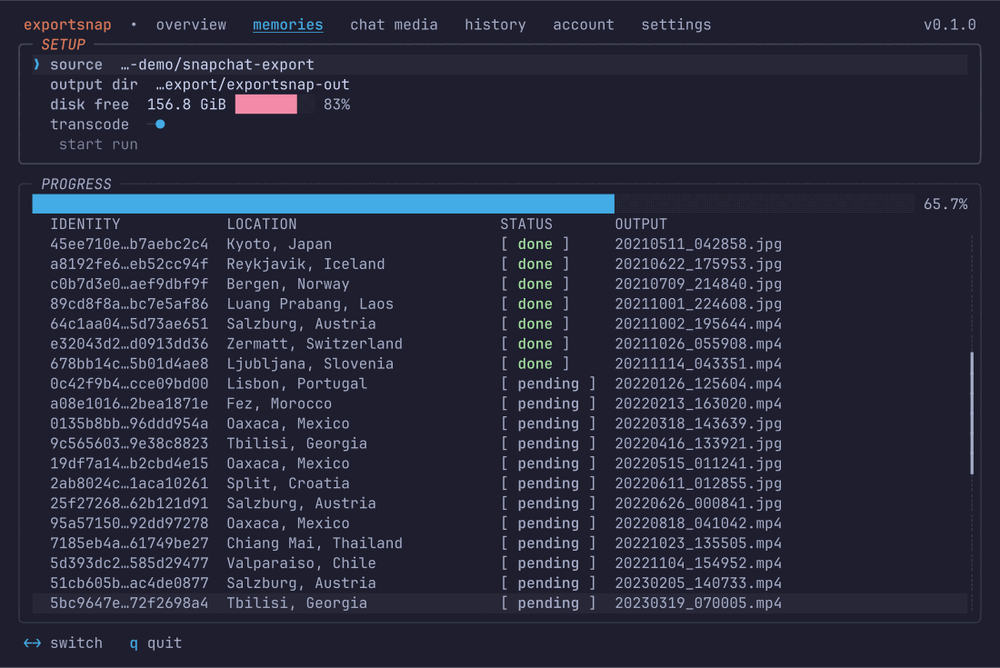

<div align="center">

# exportsnap

**Repairs a Snapchat "My Data" export offline: real capture dates written back into the files, captions merged into the photos they belong to, media filed by date and by conversation.**

A terminal app for the dump Snapchat hands over. One binary, no account, no upload.

[](https://crates.io/crates/exportsnap)
[](https://github.com/uwuclxdy/exportsnap/actions/workflows/ci.yml)
[](#license)
[](#install)

</div>

Request your data from Snapchat and you get five zip files, a folder of JSON, and thousands of media files that have been stripped of everything that made them findable. exportsnap reads the export's own manifests, pairs each entry back to the file it describes, and writes the metadata into the files. It runs in your terminal, reads only the folder you point it at, and never asks for your Snapchat credentials.

<p align="center">
  
</p>

## What the export gets wrong

| what you get | what it should be |
|---|---|
| every file stamped with the day you downloaded it | the day you took it |
| captions and stickers as separate transparent PNGs beside the photo | burned into the photo |
| memories named by uuid in one flat folder | sorted into `YYYY/MM/` and named by capture time |
| chat media with no sender, no conversation, no date | filed per conversation, dated from the message |
| chat and snap history sitting in two JSON files nobody reads | one merged transcript per conversation, in four formats |
| media spread over five zip parts that pair with a manifest in a sixth | reconciled, with the gaps counted and named |

## What it does

- **Merges overlays.** Captions and stickers ship as separate transparent images. exportsnap composites them onto the photo or video underneath, scaling to fit where the two disagree on size.
- **Writes real capture dates.** EXIF `DateTimeOriginal` for photos, the `mvhd`/`tkhd`/`mdhd` container times for video, plus the file's own modification time. The date comes from the memories manifest where an entry pairs, from the file's own embedded timestamp otherwise, and from the day in its filename last.
- **Sorts memories by date.** `2021/03/20210304_143005.jpg`, with collisions on one second resolved by position in the plan so a resumed run lands the same file in the same place.
- **Restores chat media context.** Joins `chat_media/` files to `chat_history.json`, writes the sender and conversation into the file's metadata, and files each one under its conversation's folder.
- **Exports history you can read.** Chat and snap merge into one timeline per conversation, written as `html`, `json`, `txt` and `csv`. The HTML links each media file only where the manifest says that file was written.
- **Transcodes HEVC.** Every memory video in the observed exports is HEVC, which Windows and older players routinely refuse. Transcoding to H.264 is on by default and needs ffmpeg.
- **Survives interruption.** A SQLite manifest records every item's status as the run goes. Quitting mid-run and starting again re-verifies what landed and picks up the rest.
- **Handles multi-part exports.** Five zip parts with the manifest in one and the media in three others is the normal shape. Reconciling them is the point.
- **Writes GPS when the export carries it.** The manifest's `Location` field is a place name in every export observed so far, not a coordinate, so exportsnap displays it as text and refuses to guess a position from it. Where an entry does carry coordinates, the coordinate and its timezone offset are written into the file.

## How it works

| stage | what happens |
|---|---|
| discover | finds the `mydata~*` parts under the source folder, reports which are missing |
| load | parses each JSON file into typed records, treating every file as optional |
| join | pairs manifest entries to media files by day and kind, widening to the neighbouring day where the filename's timezone and the manifest's UTC disagree |
| enroll | writes one row per item into the export's SQLite manifest |
| plan | decides every output path before writing a byte, so a resumed run agrees with the first one |
| fix | composites, transcodes, stamps metadata, sets the file date, renames into place |
| report | counts what landed, what has no media in the export, and what failed |

## Requirements

- A Snapchat data export, unzipped (see [Usage](#usage)).
- **ffmpeg**, optional. Without it, photos are fully repaired and videos get their container timestamps written. Video transcoding and burning a caption into a video both need it. exportsnap finds it on `PATH` and says so on the overview screen.
- No network access. exportsnap makes no HTTP requests.

## Install

**From crates.io:**

```sh
cargo install exportsnap
```

**Prebuilt binary** (linux x86_64, macOS aarch64, Windows x86_64), downloaded and checksum-verified against the release's `sha256sums.txt`:

```sh
curl -fsSL https://raw.githubusercontent.com/uwuclxdy/exportsnap/mommy/install.sh | bash -s -- --nocargo
```

Or grab one straight from the [latest release](https://github.com/uwuclxdy/exportsnap/releases/latest) and verify it yourself:

```sh
curl -fsSLO https://github.com/uwuclxdy/exportsnap/releases/latest/download/exportsnap-linux-x86_64
curl -fsSLO https://github.com/uwuclxdy/exportsnap/releases/latest/download/sha256sums.txt
sha256sum --check --ignore-missing sha256sums.txt
chmod +x exportsnap-linux-x86_64
```

**From source:**

```sh
git clone https://github.com/uwuclxdy/exportsnap
cd exportsnap
cargo build --release
```

## Usage

**1. Request your export.** Go to [accounts.snapchat.com](https://accounts.snapchat.com) → My Data, tick the Memories and Chat History categories, and request it. The download link arrives by email and expires quickly, so download the zips as soon as it lands. Once they are on disk, exportsnap needs nothing else from Snapchat.

**2. Unzip each part into a folder named after it.** exportsnap reads unzipped parts. The archives spill their contents flat, so each one needs its own folder:

```sh
cd ~/Downloads/snapchat
for z in mydata~*.zip; do unzip -q "$z" -d "${z%.zip}"; done
```

That leaves `mydata~1786700219713/`, `mydata~1786700219713-2/`, and so on, beside the zips.

**3. Run it.**

```sh
exportsnap --source=~/Downloads/snapchat
```

The overview screen tells you what it found. Move to the memories tab, press <kbd>↵</kbd> to start, and watch the table fill.

### Keys

| key | does |
|---|---|
| <kbd>←</kbd> <kbd>→</kbd> | previous / next tab |
| <kbd>alt</kbd>+<kbd>1</kbd>…<kbd>6</kbd> | jump to a tab |
| <kbd>↵</kbd> | start the run, or descend into the pane below |
| <kbd>space</kbd> | toggle the focused checkbox |
| <kbd>x</kbd> | dismiss a completion alert |
| <kbd>q</kbd> | go back, or press twice to quit |

### Flags

| flag | does |
|---|---|
| `--source=<dir>` | the folder holding the export's zips and unpacked parts. Defaults to the working directory |
| `--out=<dir>` | where a run writes. Falls back to `out_dir` in your config file, then to `<source>/exportsnap-out` |
| `--theme=<tier>` | `full` or `compatible`. Falls back to `[theme] name` in your config file, then to what the terminal reports |
| `--print-source` | print what exportsnap was launched against, then exit |
| `--version` | print the version and the third-party attribution, then exit |
| `-h`, `--help` | print usage, then exit |

Every flag takes the `=` form. `--source ~/dump` with a space is refused, deliberately, because a one-dash typo of a flag used to exit 0 with a wrong answer.

## Output layout

```
exportsnap-out/
  2021/
    03/
      20210304_143005.jpg          memories, named by capture time
      20210304_143005.mp4
  chat/
    <conversation>/
      20210304_143005.jpg          chat media, filed under its conversation
      history.html                 the merged chat + snap transcript
      history.json
      history.txt
      history.csv
      originals/                   the untouched sources, when you ask for them
    _no-conversation/
      2021/03/                     media no message names, by date
```

## Configuration

Everything is settable from the settings tab, which writes `config.toml` in your platform's config directory (`~/.config/exportsnap/config.toml` on linux). Every key is optional. Resolution order is flag, then this file, then detection, then the built-in default, so a key set here changes what a bare `exportsnap` does.

```toml
[theme]
name = "full"                    # "full" | "compatible"

out_dir = "/home/you/snaps"      # where a run writes
ffmpeg_path = "/usr/bin/ffmpeg"  # skip PATH detection
transcode = true                 # HEVC to H.264, on by default
overlay_mode = "both"            # "merged" | "both" | "originals"
```

A key exportsnap does not recognise is an error rather than a silent default, so a typo tells you instead of quietly dropping your setting.

## Privacy

exportsnap runs on your machine against a folder you name. It makes no HTTP requests, has no telemetry, and never asks for your Snapchat login.

Cloud upload is planned as an opt-in feature and is not in this release. When it lands it will stay off until you turn it on and authorize a provider. Nothing leaves your machine until you do that.

The run's state database holds paths from your export, so it lives in your per-user data directory at mode `0600` rather than in the output tree. Screens show counts, statuses and date ranges. The one screen that shows a conversation's name is the history picker, because picking a thread you cannot tell apart is not possible.

## Compared to the alternatives

Two other tools handle a Snapchat export. Every claim below was read off that tool's own site or README in August 2026. Where one does something exportsnap does not, the row says so.

| | exportsnap | [exportsnaps.com](https://www.exportsnaps.com) | [AIO downloader](https://github.com/ethanwheatthin/All-In-One-Snapchat-Downloader) |
|---|---|---|---|
| price | free | free to 200 files, $14.99 one-time beyond | free |
| license | `MIT OR Apache-2.0` | closed | "as-is for personal use" |
| runs as | one native binary, all three platforms | desktop app | desktop app; macOS and Linux builds are labelled alpha |
| overlay merge | yes | yes | yes |
| EXIF dates | yes | yes | yes |
| GPS | where the export carries coordinates | yes | yes |
| chat media | yes, filed per conversation | memories only | yes |
| chat + snap history export | `html`, `json`, `txt`, `csv` | no | no |
| HEVC to H.264 | yes, with ffmpeg | not documented | yes, with VLC |
| multi-part zips | yes, unzip them yourself first | not documented | yes, unzips them for you |
| resume after a crash | per-item SQLite manifest | yes | yes |
| upload to your cloud | planned, opt-in | paid add-on | no |

The AIO downloader unzips the parts for you, which exportsnap does not. exportsnaps.com sells a cloud add-on that streams output to your own Drive or Dropbox. Both are worth knowing before you pick.

## FAQ

**How do I fix the dates on my Snapchat memories?**
Unzip the export, run `exportsnap --source=<the folder>`, and start the memories run. It writes the capture date into each file's EXIF or container metadata and into the file's modification time.

**Why do my Snapchat memories come with separate PNG files?**
Those are the overlays: captions, stickers and drawings, shipped as transparent images beside the photo or video they belong to. exportsnap composites them back on.

**Does the Snapchat data export link expire?**
Yes. The link Snapchat emails you is signed and short-lived, so download the zips promptly. After that the export is just files on your disk and exportsnap works on them indefinitely.

**Do I need ffmpeg?**
Only for video. Photos are fully repaired without it. Video transcoding and burning a caption into a video are the two things that need it.

**Does exportsnap upload my data anywhere?**
No. This release makes no network requests at all.

**How do I export my Snapchat chat history to a readable file?**
The history tab lists your conversations. Tick the ones you want, tick the formats, and export. Each conversation gets `history.html`, `history.json`, `history.txt` and `history.csv` in its own folder.

**Why are some memories missing from the output?**
Because the export is missing them. The manifest lists entries whose media is in no part of the delivery. exportsnap counts those as `source_missing` rather than reporting a success it did not earn.

**Can exportsnap download my memories from Snapchat's servers?**
No. It does not need to: the per-media download links in `memories_history.json` are empty strings in every export observed. The media ships inside the zips instead.

## Development

```sh
cargo fmt --all
cargo clippy --all-targets --all-features -- -D warnings
cargo test --all-targets --all-features
cargo deny check
cargo audit
```

Tests that need an external tool or a local fixture tree skip when it is absent. To turn a missing prerequisite into a failure instead of a skip, export `EXPORTSNAP_REQUIRE_FFMPEG`, `EXPORTSNAP_REQUIRE_EXIFTOOL` or `EXPORTSNAP_REQUIRE_FIXTURES`. CI exports the first two on every leg.

`THIRD-PARTY-LICENSES` is generated, never hand-edited:

```sh
cargo about generate about.hbs -o THIRD-PARTY-LICENSES
```

## License

`MIT OR Apache-2.0`, at your option. See [LICENSE-MIT](LICENSE-MIT) and [LICENSE-APACHE](LICENSE-APACHE).

The binary embeds timezone boundary polygons derived from OpenStreetMap, licensed under the [ODbL](https://opendatacommons.org/licenses/odbl/1-0/). `exportsnap --version` carries the attribution. The full third-party notices ship as [THIRD-PARTY-LICENSES](THIRD-PARTY-LICENSES).
